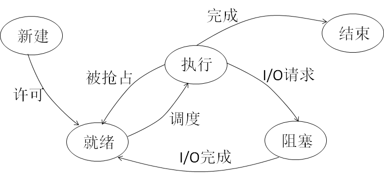
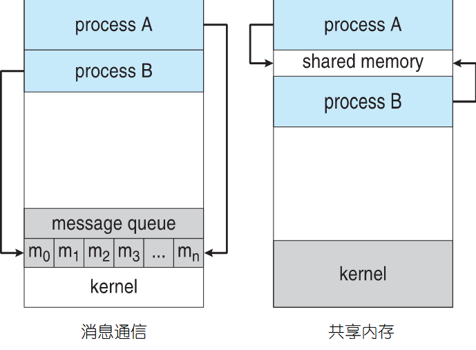
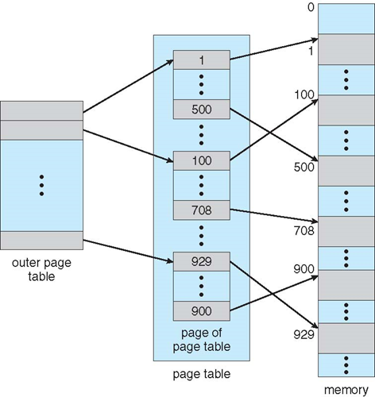

> Note:
>
> 1. 文档是参照着杨兴强老师的PPT一页一页总结下来的，包括了大部分PPT的内容（有些具体举例之类的文档里没有），看PPT不方便的可以直接看这个文档
> 2. 文档纯手打，可能有错字/拼错的英文单词
> 3. 没啥重点，基本流水账所有的内容都覆盖了一遍，请结合老师画的重点有选择性的复习
> 4. MIT License（随便修改使用）

### 第一章 计算机架构

#### 1-1 图灵机

运算规则：根据当前的状态和读入的符号，决定下一个状态

架构：纸带（存放输入输出）、读写头HEAD，状态寄存器、控制规则表相当于程序代码

> 对于任意的一个任务，若存在一个图灵机可以执行该任务，则称该任务是可计算的

> 操作系统可以看成一台通用图灵机

#### 1-2 电子计算机

**第一台电子计算机**：【ABC】Atanasoff-Berry Computer 阿塔纳索夫-贝利计算机

- 全部使用电子器件执行所有运算
- 没有CPU，没有指令；不可编程
- 采用二进制运算
- 不是图灵完备的

**第一台通用电子计算机**：【ENIAC】Electronic Numerical Integrator And Computer

- 算法是硬化（hard coded，即在硬件层面上编程）到机器中的
- 图灵完备
- 可以编程，可以通过重新链接线路来修改算法，能执行循环、分支、子程序等
- 不是储存程序计算机
- 第一位程序员（Ada，女性）

**第一台商用电子计算机**：【UNIVAC I】

> 在UNIVEC I计算机上进行过实用程序的编写，预测大选，英语语句等

#### 1-3 存储程序计算机

**特点**：

- 程序和数据在执行时存放于内存中
- CPU从内存中读取指令执行
- 指令流的控制依赖于地址

**好处**：

- 软硬件分离，不用重连线路硬件编程
- 引出了装入程序和管理软件的操作系统

**第一台存储程序架构计算机**：【EDSAC】Electronic Delay Storage Automatic Calculator

- 五个部件：控制器，运算器，内存，输入，输出

**装入（load）**：

- 将程序从外存读入内存特定位置的过程
- 内存一般是易失性存储器，必须运行前现装入
- 完成装入工作的程序称为“装入程序（loader）”，一般存放在ROM中，开机时PC指向装入程序的入口地址

**绝对代码**：

- 绝对代码：装入到的位置由程序员指定，整个内存空间由用户程序支配
- 自由，但可移植性差

#### 1-4 指令集架构

- 从不可编程到可硬件编程再到存储程序，计算机变得越来越灵活，硬件实现部分被封装好，程序员不再需要面对硬件，而是调用现成的指令集，将指令集组合在一起形成可移植性高的程序，称为软件

- 指令集架构（Instruction set architecture, ISA）就是软件与硬件的分界面

- 指令系统的实例和发展：
  - 早期服务于汇编语言程序员
  - 现在基本就编译器在用指令集架构
  - 指令集架构支持操作系统对计算机资源的有效管理以及虚拟化的实现
- ISA的发展：
  - CISC：复杂指令集计算机（如x86）
    - 复杂功能尽可能都用硬件实现
  - RISC：精简指令集计算机（如ARM，RISC-V）
    - 用软件实现复杂功能
- 特权指令：
  - 能对系统中关键资源进行操作的指令
  - 仅在内核态下才能执行
  - 一般只提供给操作系统

### 第二章 程序设计与操作系统

#### 2-1 一个简单的程序（举例）

- 程序和指令集架构的关系
- 程序在内存中的布局
- 程序流的控制方式（如循环、分支和子程序）
- 程序的启动和结束
- 数据的初始化
- 栈在程序运行过程中的作用

#### 2-2 访问内存

**储存架构**：

1. 寄存器（CPU运算单元）
2. 内存（CPU直接访问）
3. 外存（CPU间接访问）

- 物理地址：内存单元的编号
- 物理地址空间：所有内存单元地址构成了一个从0开始连续、线性的地址空间
- 绝对代码：使用物理地址，绑定在硬件机器上，一个程序独占全机内存
- 虚拟地址：一段由地址映射机制建立在物理内存之上的、供用户程序访问的地址空间，其中每个地址由MMU对应到一个物理内存空间上
  - 注意：CPU面对的也是虚拟地址，它需要访存的时候会把虚拟地址交给MMU，MMU做变换之后得到物理内存上的数据，然后传递给CPU
  - 物理地址CPU和程序都看不到
- 内存管理单元（MMU，Memory Management Unit）
  - 属于操作系统的一部分
  - 通过地址总线获取内存中的物理单元
- **静态重定位**：在程序运行前（装入时）就一次性将所有的虚拟地址变换为物理地址，在程序运行过程中不再做内存变换
  - 缺点：内存空间中途不能移动，各个用户进程很难共享内存中同一程序的副本
- **动态重定位**：在程序运行过程中，需要访问地址的地方现进行重定位，完成地址映射。装入后的程序仍然是逻辑地址（虚拟地址）
  - 缺点：需要硬件寄存器支持
- 地址保护：防止程序修改操作系统或其它用户程序的代码或数据
  - 实现：上下限寄存器，基址、限长寄存器
  - 或者软件实现：设置寄存器和特权指令

#### 2-4 访问外设

- I/O设备
- CPU与设备的接口（不是物理上的接口，而是数据传输的格式、传输方式、操作方法等）
  - 实现I/O接口的硬件电路称为设备控制器
- 设备控制器的基本组成：
  - 数据总线、地址总线、控制总线
  - I/O端口
  - 数据缓冲：协调数据访问和读取速度不一的问题（设备取出数据一次取一大堆，CPU需要一个个访问）
- 设备与内存的统一编址：
  - 将端口看作内存单元，与内存单元统一编址；访问端口就跟访问内存一样，无需额外的指令
- **设备控制方式**：
  - 中断：完全中断，CPU停下来干等
  - DMA（Direct Memory Access）：CPU初始化一下DMA，剩下的传输工作由DMA控制器来完成。比如传输数据，CPU只要点一下头，DMA负责搬东西

- 驱动程序（Driver）：直接控制设备的程序叫驱动程序，一般由硬件的开发商提供

#### 2-4 子程序

#### 2-5 运行栈

**栈帧**：Stack Frame

每个函数将声明的局部变量放在栈中，在函数结束时释放占用的栈。

需要存储的东西：

- 传递给子程序的参数
- 返回地址
- 局部运行环境（如局部变量，寄存器的内容）

#### 2-6 程序设计语言

- 机器语言
- 汇编语言
- 高级语言
- 代码转换

#### 2-7 程序的链接

- 地址回填
  - 链接所要做的就是在所有引用他们的地方填上符号名新地址
  - 链表法：建立一个链表，记住所有引用的位置，地址确定之后沿着链表回填
  - 间接地址法：对于一个储存单元，存放符号y的地址；在地址确定后仅回填当前单元
- 静态链接：
  - 在程序运行之前就将所有的模块链接起来，形成一个完整的可执行程序
  - 链接生成的可执行文件复制了所有可能要调用到的程序，任何模块的更新，必须重新链接
  - 不能程序共享
- 动态链接：
  - 链接操作推迟到不得不链接的时候才去做，即什么时候用到什么时候链接

- 可执行文件：
  - 初始化数据存在其中
  - 不包含栈、未初始化的数据

### 第三章 程序运行与操作系统

#### 3-1 程序的装入

可执行文件的结构：链接程序+装入程序

作用：存放代码和数据（就像降落伞装在包里），需要经过装入到内存中才能展开发挥作用

为什么要折起来？节省空间

#### 3-2 程序的执行

CPU沿着指令编号寄存器的顺序依次执行每一条代码不断前进，直到停机

指令流的运行环境：比如上一条Add a, b，下一条Mov sum, ans，这里的运算结果储存在寄存器中；上一条指令留下的全部信息，CPU寄存器、内存、设备就是运行环境

**异常**：程序执行过程中遇到各种程序员无法避免的错误，会在指令的执行过程中由CPU检测出来并发出警告

- 可以修复的异常；不能修复的异常

- 高级语言中Java的异常会提交给JVM（Java Virtual Machine）然后寻找能处理这一异常的代码并交给它处理

**陷入**：程序主动寻求帮助

- 断点调试：int 3
- 系统调用：trap指令

（**来自外设的中断**）：在I/O设备上能实现与CPU的并行工作，什么时候I/O设备处理完成了用陷入通知CPU；广义上说来自人的指令也可以归为这一类

> 异常与陷入的区别：异常是被动触发的，陷入是主动触发的

**中断**：要求CPU暂停当前指令流的执行，去执行另一个进行事件处理的指令流，处理完之后再返回，这种机制被称为中断（Interrupt）

简单来说就是被打断当前工作，异常和陷入都属于中断

| 属性       | 意外事件 | 指令流改变 | 内部中断 | 外部中断 |
| ---------- | -------- | ---------- | -------- | -------- |
| 异常       | √        | √          | √        | ×        |
| 设备中断   | ？       | √          | ×        | √        |
| 陷入       | ×        | √          | √        | ×        |
| 子程序调用 | ×        | ×          | ×        | ×        |

**中断与子程序处理的区别**：中断一般是随机事件触发（除陷入）不同的指令流，完成不同的任务，防止遭到破坏

#### 3-3 中断响应

> INTR: Interrupt Request
>
> INTA: Interrupt Answered

**中断请求**：外设向CPU发出INTR信号

**中断控制器（Interrupt Controller）**：汇集中断信号 → 进行排序 → 依次向CPU发出中断请求INTR（也发送中断请求的设备类型号，通过公用的数据总线）

**CPU不响应的中断**：关闭中断使能Interrupt Enabled

**中断向量**：异常、陷入、外部中断统一编号，用来表明中断的类型

**计算中断处理程序的入口地址**：接收到中断向量后，CPU会根据终端类型进行不同的处理，调用不同的处理程序

**保护上下文**：

- 保护断点：当前的PC寄存器值
- 保护程序状态字PSW
  - PSW包括的状态位有：进位位、中断使能位、CPU模式位等
- 不保存当前的内存和内存中的栈存储（因为有其它的替换方法）

**中断重入**：

- 中断嵌套
- 中断重入：多次进入同一个中断响应程序

**关中断**：

- 关中断的作用就是为中断处理程序的运行提供一个安心的、不被打扰的环境
- **由硬件实现**，作为默认选项，是中断响应的一个操作
- 对于不可屏蔽中断，关中断是不起作用的
- 关中断时间不能太长，关中断过长会造成紧急事件延误或数据丢失
- 后面要由软件打开中断，以允许中断嵌套或重入

**总结**：

1. 由硬件发出外部事件、CPU发出异常、程序的陷入触发一个中断
2. 保存现场：保存PC、PSW
3. 查询中断号
4. 计算中断处理程序的入口地址
5. 关中断
6. 调用中断处理程序

#### 3-4 运行时系统

【Runtime System】

举例：

- 堆、栈的管理程序
- 垃圾回收
- 数据类型检查
- 内存管理、进程管理、异常管理

**处理子程序调用的运行时系统**：

1. 通过栈传递调用参数
2. 为子程序的局部变量再栈中分配空间
3. 运行结束后返回操作系统

**处理动态内存管理的运行时系统**：

- 动态分配新的内存
- 内存的动态释放
- 检测不使用的内存空间并进行垃圾回收

**处理多线程的运行时系统**：

- 用户的一条语句就可以创建一个新线程
- 管理复杂的多线程任务

> 运行时系统是以程序库的形式存在，再链接时被添加到可执行文件中

> 运行时系统一部分连接操作系统指令，另一部分直接调用硬件和ISA

#### 3-5 系统调用

- 系统（操作系统）向用户程序提供的API接口，比如进程控制、文件管理、设备管理、信息维护、进程通信

- 这些服务程序在操作系统内核态下运行，因而会导致CPU的运行模式发生改变
- trap（陷入）也是一条系统调用程序，根据中断向量表，转向中断处理程序
- 类似子程序调用的原理
- 举例：
  - 汇编语言：`trap`、`syscall`
  - 高级语言：`open()` 打开文件 `fork()` 创建进程

#### 3-6 程序的终止

**停机指令HALT**：让CPU不再随着时钟脉冲信号取指令执行，切断时钟与CPU的联系

- 属于特权指令

- 中断信号会使RUN重新置位（硬件实现的，不依赖CPU），从而唤醒CPU
- 用户程序结束时仅是将CPU控制权交回操作系统，最后一条是一个特定的系统调用exit（高级语言编译时会自动加上）

### 第四章 操作系统的形成和发展（全面介绍操作系统）

#### 4-1 操作系统之前的人机交互

**「作业」（Job）**：

举例：程序的编译

1. 安装编译程序纸带
2. 卸下编译程序纸带，安装源程序纸带
3. 执行编译程序，读入源程序，输出目标程序
4. 取走目标程序纸带

**早期人机交互**：人起到了关键作用，操作员都是计算机科学大师

后来CPU越来越快，人跟不上CPU的速度，因而产生了批处理（bash）

#### 4-2 4-3 批处理和脱机输入输出

**早期批处理**：提取作业共性内容统一装入，连续执行多个相同类型的作业

后来发展出自动装入作业：装入监控程序（Monitor），每次装入一个作业并执行，再装入再执行直到处理完成；早期的操作系统诞生

**作业控制语言（JCL）**：用于控制作业的自动化执行

**第一个操作系统**：GM-NAA I/O，使用批处理系统将系统吞吐量提高了10倍

**脱机输入输出**：随着CPU速度进一步提高，输入输出又变成新的瓶颈，运算五秒钟读入两小时；现在使用「卫星机」专门用于I/O的小计算机，直连设备，再与CPU进行数据通路上的通信

#### 4-4 4-5 多任务和分时

**多任务操作系统**：因为作业切换用时太长不方便

**并行**：只有物理上分离才能做到真正并行（同步），比如CPU与设备、设备与设备之间、CPU的不同核之间

**并发**：宏观上同步执行，微观上交替执行

**多任务的实现**：

- CPU的切换
- 内存中同时装入多个作业
- 设备共享
- 保证作业间不互相影响

**分时技术**：多个交互作业轮流执行，每次一个时间片 `Δ`，用户最多等待`(n-1)*Δ`

**交互型作业**：编程、文字处理、游戏等，人的反应时间时秒级的，远远慢于操作系统响应时间，可以使用分时来让CPU不用等人

- 一方面提高CPU利用率，一方面又提升用户体验

#### 4-6 操作系统概念的形成

**操作系统概念**：操作系统是为应用程序提供运行环境的资源管理软件

- 基于资源
- 构建虚拟化运行环境
- 服务者、管理者、控制者

#### 4-7 4-8 4-9 操作系统内核

**内核的功能**：

- 中断处理
- 系统调用

**内核的关系**：

- 内核为应用程序运行提供管理和服务
- 用户感受不到内核存在

**内核之外**：

- 操作系统的用户接口（终端，或Windows的图形交互界面）
- 命令解释器（解释用户输入的指令，类似脚本语言的解释器）
- 内核之外的程序（文件管理器，终端，设置软件等）

**内核的设计**：

- 分层
- 微内核：内核只负责模块间的通信，功能放在用户程序中（类似ROS）

#### 4-10 4-11 操作系统的研发、安装与引导

**操作系统的调试**：日志文件crash dump；core dump

**操作系统的引导**：Bootstrap program

### 第五章 CPU管理 / 进程管理

#### 5-1 程序运行过程的描述

**程序并发执行**：利用前面所说的分时技术

- 分时技术要做到：保护和恢复上下文（context）
- 并发执行：每个程序在一个虚拟CPU上运行，每个程序自己都认为是独占了整个CPU
- 逻辑上连续执行，实际上交替执行

**线程定义**：程序在虚拟CPU中运行过程

这五个过程由**线程控制块TCB(Thread Control Block)**来完成，是操作系统描述和管理线程的数据结构，线程暂停时数据会从CPU的寄存器移动到线程控制块内

具体属于哪种状态？应该看与CPU之间的关系来划分

资源的保护与共享：OS的要点：**隔离**（时、空）

#### 5-2 多线程进程

**线程与进程的区别**：一个进程中包含多个线程，进程是一整个应用程序，而线程一般是一个应用程序中的任务，线程也被称为”轻型进程“

- 一个进程中的线程之间的数据共享可以在进程的堆栈区进行
- 不同进程之间的线程是相互隔离的
- 创建新进程的代价要远高于创建线程，新进程要创建虚拟环境，新线程秩序分配特定的资源即可
- 进程之间的上下文切换代价更高，需要保护cache、TLB、内存

**内核级线程**：由操作系统内核创建管理的线程

- 在线程调度时可以抢占
- 切换代价高
- 阻塞时只会阻塞自己
- 适用于多核CPU

**用户级线程**：由用户自己创建和管理的线程

- 非抢占式
- 绿色线程（由用户程序虚拟机或用户自己管理切换、调度、阻塞，而不是交给系统进行调度的统一管理）
- 当一个线程阻塞时其它线程也会阻塞；同时只能有一个线程正在运行（目的是节省系统资源，不造成过大开销）
- 不适用于多核CPU，因为是用户自己搭建的虚拟环境，所以不能很好的利用系统的线程调度算法运行在多个CPU上（访问不到底层）

**内核级和用户级的区别**：

- 简单来说就是有些线程觉得用系统那一套管理方法太费劲，于是自己创造了一个虚拟环境上面运行各种线程，就叫用户级进程
- 用户级进程是操作系统内核无法感知到的
- 整个用户级线程也是运行在一个或多个内核级线程上的，系统只能感知到这一个或多个内核级线程，感受不到用户层面发生了什么

#### 5-3 进程的创建和销毁

**进程的创建**

- 进程控制块：生成一个进程标识符pid
- 建立虚拟运行环境
- 初始化

**进程的销毁**

- 所有线程执行结束
- 进程推出：exit()，返回给父进程状态，被父进程wait感知到
- 父进程销毁子进程：abort()
- 释放进程的全部资源，销毁虚拟环境
- 特殊情况：
  - 僵尸进程：进程已经结束，但父进程并不执行wait为进程「收尸」
  - 孤儿进程：结束时发现父进程已经退出，会被init进程「收留」

**进程树**：

- 第一个进程init（根）
- 它创建子进程，子进程再创建子进程

**父子进程关系**：

- 可以选择共享多少资源、哪些资源共享（类似public，protected，private）

#### 5-4 CPU调度

**CPU调度器**：按调度算法选择一个就绪线程（这是多线程操作系统中关键的程序模块）

- 什么时候执行调度器？
  - 当前线程执行结束
  - 当前线程主动放弃CPU（比如sleep）
  - 当前线程阻塞
  - 就绪队列中出现更高优先级的线程（比如那个线程阻塞了，现在阻塞消失了）
  - 时钟中断

**CPU执行器预估（CPU burst）**：估计这个线程会占用多长时间的CPU

- 方法：先设定一个初始值，然后记录下一次的运行时间，新的预估等于上一次预估与实际运行时间的加权平均

**抢占式调度**：切换不是当前线程的意愿，比如4. 就绪队列中出现更高优先级的线程 / 5. 时钟中断

**非抢占式调度**：当前进程自己想切换，对应剩下的1 2 3

**两者比较**：及时性？系统开销？

**空闲进程（Idle）**：只去调用CPU调度器的进程

- 优先级最低，仅在就绪队列为空时才会执行
- CPU卡在调度器和空闲进程之间出不来了怎么办？（因为有些进程需要CPU运算得到就绪信号）
  - 外部设备的中断（例如用户输入的中断）
  - 时钟中断
  - 这些会使CPU进入中断处理程序 → 重新使其它进程进入就绪队列

**操作系统中其它调度的类比**：

- 作业调度
- 内存调度（交换）
- I/O调度
- 调度的频率

#### 5-5 CPU调度算法

**调度算法衡量指标**：

- CPU利用率
- 吞吐量：单位时间内完成进程的个数
- 等待时间：线程在就绪队列中的时间
- 响应时间：从用户提交请求到系统做出反馈的时间
- 周转时间：等待时间+运行时间
- 响应比（加权周转时间）：(等待时间+运行时间)/运行时间

##### 先来先服务：FCFS

- 到达时间靠前的优先执行
- 优点：
  - 简单
- 缺点：
  - 平均等待时间长
  - 缺乏综合考虑
  - 先来了一个超长超难任务，直接把后面所有线程挡住

##### 短作业有限：SJF

- 执行时间短的作业优先执行
- 优点：
  - 平均等待时间最短（可以证明）
- 缺点：
  - 饥饿（Starvation）一直来各种短作业，长作业永远没有机会得到CPU
  - 抢占式更加体现短作业优先的特点，会使饥饿更加严重

##### 响应比高者优先

- 响应比：周转时间/执行时间 =  (1+等待时间)/CPU执行期
- 「等得越久越优先」，而且对于执行时间短的作业来说每等一秒都增加很多优先级
- 前两个算法（FCFS和SJF）的折中
- 优点：
  - 减少饥饿现象
- 缺点：
  - 考虑仍不全面

##### 优先权

- 优先权（Priority）：用优先数表示，数字越小越优先

- 静态优先数：优先数仅有作业类型决定

- 动态优先数：在执行过程中动态变化

  - 比如：CPU每执行一个周期优先数+1（优先级降低），每等待一个周期优先数-1（优先级提高）

- 优点：

  - FCFS、SJF、响应比都可以设置成优先数

  - 实时系统最适合的调度算法

    > 实时系统：对完成时间要求非常高的系统，比如无人机系统的飞行控制，如果在规定时间内算不出来应该怎么飞，飞机就很可能撞上障碍物而使整个系统被毁
    >
    > 也分为硬实时和软实时系统，硬实时比如上面的无人机，软实时比如游戏系统，反馈时间长会使玩家游戏体验变差，不过不至于整个系统被毁

- 缺点：

  - 动态优先权中优先数需要实时更新（无可厚非）

##### 轮转法调度：RR，Round Robin

- 所有线程轮流执行，每个线程执行一个时间片
- 优点：
  - 响应时间最短（最长不超过总线程数*时间片长度）
  - 用户体验良好，所有用户都能在第一时间得到反馈，适合交互系统
- 缺点：
  - 线程切换频繁，系统开销大
  - 虽然响应很快，但是可能所有任务都拖到最后一刻才完成

##### 多级队列调度

- 不同线程的需求不同，有的是硬实时，有的是交互等等，适合的调度算法也不同
- 将进程按照类型分成不同的队列，每个队列采用最适合自身的调度算法
- 队列之间采用一个总的调度算法

##### 优化：多级反馈队列

- 在多级队列中，线程的类型和队列是绑定在一起的
- 多级反馈队列会动态检测，适时调整线程所处的队列

#### 5-6 上下文切换

**线程上下文**：描述线程在任何一个时刻的运行环境

- CPU状态：
  - 程序计数器PC
  - 通用寄存器
  - 标志寄存器：储存CPU运行模式等信息
  - 基址、页表寄存器：用于地址变换
- 中断屏蔽寄存器

**上下文切换**：

- CPU调度程序、CPU分派程序（dispatcher）

- switch、return

  > 原子操作：指过程不可再分割，不会执行到一半突然切换到其它线程去了

**上下文切换的代价**：

- 同一进程、不同进程的线程
- 用户级线程、内核级线程

#### 5-7 进程通信

线程之间信息共享可以通过共享地址空间，毕竟同一个进程内的地址空间都是固定的

**进程间通信（Interprocess Communication，IPC）**：

- 通过操作系统共享数据资源
- 两种模式：消息传输 / 共享内存

**共享内存**：

- 虚拟地址映射到相同的物理地址
- 多个进程都可以访问各自的虚拟内存区域
- 应用程序负责数据同步，操作系统提供同步工具

##### 消息传输模式：

- 直接通信：
  - 要求对方在线，直接收发
- 间接通信：
  - 通信前建立邮箱（消息队列），把信息放入消息队列中
  - 双方可以不同时在线

### 第六章 内存管理

#### 6-1 内存地址空间

内存是相对灵活、自由的一种资源，就像一张白纸，上面怎么分区、数据怎么储存都由操作系统说了算，硬件不提供太多的辅助

**物理地址与物理地址空间**：就是实际的内存单元地址，物理地址的集合叫做物理地址空间，也就是CPU能访问到的内存范围

**虚拟地址与虚拟地址空间**：虚拟地址（逻辑地址）即程序在编译时使用的地址，也是CPU生成的地址，虚拟地址的集合叫虚拟地址空间

**管理方式**：

- 连续内存管理
  - 操作系统给每个进程分配一段连续的内存区域
  - 典型例子：分区
- 非连续内存管理：
  - 进程再内存中非连续存放
  - 分段、分页以及段页式

#### 6-2 连续内存分配

- 特点：
  - 地址变换、存储保护比较容易实现
  - 支持多种实现方法
  - 无法实现内存共享
  - 不支持虚拟存储
  - 容易产生碎片
  - 对于特大作业或大量小作业适配性差

##### 连续内存分配 - 固定分区：

- 实现：

  - 操作系统事先将内存划分成多个区域，分区个数一般是固定的
  - 每个分区在每个时刻只能分配给一个作业（运行一道程序）
  - 分区大小、位置固定
  - 分区大小可以相等，也可以不等；实际应用中往往分成2、4、8、16、32这样递增大小的分区
  - 在系统中储存一个“分区分配表”，说明每个分区的分配情况

- 优点：

  - 实现简单

- 缺点：

  - 会产生内碎片

    > 内碎片：一般情况下，分区分配给一个作业后，该分区都会留下一部分区域不能被利用，称为“碎片”，这种已经分配出去（能明确指出属于哪个作业）但不能被利用的内存空间称为内碎片
    >
    > 比如使用6MB内存的程序被装入了一个8MB的内存空间，会产生2MB的内碎片

    - 如果采用相同大小的分区可能会使小作业占用大空间，产生大量内碎片

  - 特别大的作业可能找不到合适的分区

  - 分区个数固定，限制了系统进程的并发度

##### 连续内存分配 - 动态分区：

- 事先不对内存进行划分，而是根据作业的实际大小为其分配内存

- 典型的分配算法：

  - 首次分配：检索到第一个能塞下的分配
  - 最佳分配：在所有空闲分区中最小的空闲分区被选中（容易产生碎片）
  - 最差分配：在所有空间中最大的被选中（不容易产生碎片）

- 缺点：

  - 会产生外碎片

    > 外碎片：分区太小以至于无法分配给任何作业的空间称为外碎片
    >
    > 比如一个6MB的内存空间被释放后来了一个5MB内存的作业，分配之后发现剩下1MB，这1MB谁也不够用，就产生了外碎片

#### 6-3 分段

**核心思想**：

- 将内存视为一组长度不同的段，这些段之间使没有先后顺序的

- 对于一段作业，将它的不同模块装入不同的分区中，以一个或几个模块（可能是一个库、一组数据、一个堆栈等）作为内存的分配单位
- 虚拟地址的表示形式：类似二维的形式：「段号+段内偏移量」
- 比起连续管理中的动态分配：以「段」为单位，而不是以作业为单位

**段表**：

- 保存在内存中
- 记录每段在内存中的位置
- 段基址+段长，对应段号+段内偏移量，储存在专门的段基址寄存器和段长寄存器中

**MMU变换时**：

1. 比较段号和段表长度寄存器，是否段号越界
2. 在段基址寄存器中查段号，得到段基址和段长
3. 比较偏移量和段长，是否段长越界
4. 将段基址和偏移量相加，得到物理地址

- 时间开销：段表在内存中，所以需要两次访存，一次得到段基址和段长，一次取出数据
- 特点：
  - 段是程序员可见的，有逻辑意义
  - 每个段采用连续分配方式，仍然存在碎片问题

#### 6-4 分页

**核心思想**：

- 集装箱式的管理
- 物理地址和虚拟地址都按照同一尺度进行划分，一般页大小为2^n（常用1KB），将一个作业分成1KB1KB的小份存入每个页中，保证只有最后一页会有碎片
- 使用TLB技术加速地址变换
- 现在的大多数操作系统正在使用的方案

**页表**：

- 给出页和页框的对应关系，也就是虚拟地址的一页实际上对应的是物理地址的哪一页

**MMU变换时**：

1. 页内地址 $d = V_{addr} \space mod \space size$
2. 页号 $p = V_{addr} \space / \space size$
3. 根据页号查页表，得到页框号 $f$
4. 物理地址 $P_{addr} = f*size + d$

**时间开销**：

- 原始方案跟分段一样，两次访存
- **TLB方案**：
  - 在CPU中设置一个专门的寄存器存储区，仅存部分页表，叫TLB
  - 采用并行查找，命中率在97%以上
  - 基于局部性原理，这一次找的地方与上一次不会相隔太远

**特点**：

- 页是系统划分的，对程序员透明，但不具有逻辑意义；程序员使用的是逻辑地址空间中的一维地址
- 宏观上没有碎片，微观上每个作业的最后一页平均会有1/2的空间被浪费，称为页内碎片；但是一般页相对较小，很少关注这点碎片
- 作业在内存中不连续存放，页的装入与段比较相似

**共享**：

- 不同作业共享相同的页框（不同的虚拟地址指向相同的页框号）针对代码的逻辑单元，考虑将逻辑单元与页边界对齐（优点类似段页式）

**优化：多级页表**：

- 现代计算机地址空间增大，页是1KB这个数量级，导致页表非常大

- 解决方案：多级页表

- 最外层页表连续即可，内部指向的页表可以分段不连续
- 虚拟地址分为页目录号+页号+页内地址

**优化：段页式**：

- 先分段、再分页
- 段表内储存页表编号

#### 6-5 请求调页

**虚拟内存技术**：

- 将内存抽象为一个大数组
- 有利于文件与内存的统一

**调页**：

- 对于非连续分配模式有效
- 进程执行时不用一次性全部装入内存，而是由系统实现对换功能
- 因为作业各部分在内存中不连续，因此可以只装入需要的部分
- 执行进程前，只将PCB装入内存
- 当检测到要访问的内容不在内存中时，报缺页异常，会被调页系统响应

**请求调页**：

1. 缺页异常，由MMU检测到并引发
2. 被中断相应程序响应，进入系统
3. 写回换出页，检测脏位
4. 读入换入页
5. 更新页表：页框号、存在位
6. PC保持不变，重新执行

**请求调页的实现**：

- ISA需要有页故障异常、存在位和脏位等
- 操作系统需要有针对页故障的中断处理程序
- 硬盘需要设置对换区

**内存映射文件**：

- 将需要访问（频繁访问、多个进程访问）的文件放入内存中
- 优化了访问效率

**请求调页的效率**：

- 页的换入换出最耗时，因为需要执行磁盘的I/O操作
- 缺页率：缺页次数 / 访存次数
- 访存比换页快约10^6倍
- 因此缺一页就对访存的影响非常大

#### 6-6 缺页率

**局部性原理**：

- 时间局部性：访问过的信息很可能再次访问
- 空间局部性：下一次访问过信息都在附近

**局部模式（Locality Mode）**：

- 进程访问页的集合在使用上具有关联性，一段程序或数据一般由若干个局部组成
- 将访问的内存空间视为从一个局部迁移到另一个局部，这个“迁移”就是由页置换实现的

**抖动**：系统忙于换页，CPU利用率低

- 此时应该做的：暂停一些进程，否则进程一多内存不够导致缺页率进一步升高

**降低缺页率的方法**：

- 编写程序时遵循局部性原则
- 分配足够的内存，能容纳下当前的局部
- 置换算法

**工作集**：进程在某个时刻 $t$ 之前 $Δ$ 次访问所有的页的集合

- 随着 $Δ$ 增大，工作集也会增大，但是增大的速度越来越慢（局部性）
- 当工作集不怎么再增大时，数值上 $WS \space / \space \Delta$ 认为是进程当前的局部（WS是工作集的页数）
- 同理， $t$ 增大到一定程度工作集不再增大说明到达了时间上的局部

##### 分配页框

内存就那么多，要分给当前的各个进程，还要考虑降低缺页率

**考虑的因素**：

- 降低缺页率
- 防止抖动
- 进程数量
- 工作集

**进程需要的最少页框数**：

- 最简单的指令仅需要一个字节，也需要分配一个页框
- 间接访问指令 LOAD R, *[10000]间接访问10000号单元，需要2个页框
- 块拷贝指令等，需要分配更多页框
- 与计算机的体系架构相关

**操作系统的分配策略**：目标不是能执行就行，而是降低缺页率

**页框分配方法**：考虑按比例分配或按优先级分配

#### 6-7 置换算法

**目的**：选择淘汰的页并调入新页；注意这里只有淘汰的页能选择，新页是固定的，缺哪页调哪页进来

**目标**：

- 降低缺页率
- 保留进程的局部还在内存中

##### 最优置换

- 淘汰将来最久不用的页，即将在最晚的时刻才被用到的页
- 没法实现，只是理论上最优的情况；其它算法效果越贴近它越好

##### 先进先出FIFO

- 替换在内存中驻留时间最长的页

> Belady异常：页框数量越多，缺页率反而越高
>
> 是因为算法的缺陷导致的，说明算法策略有问题

**最久未用LRU**

- 最长时间没有用的被替换掉
- 假设：正在使用的东西将来还要用
- 优点：
  - 是最优置换的镜像（对称）算法
  - 逻辑上比较科学
  - 栈算法，不存在belady异常
- 缺点：
  - 需要记录内存中所有页最后一次被访问的时间，比较耗时

##### LRU优化：Clock方法

- 基于引用位的硬件设计
- 在内存中的页组成一个环形链表
- 需要淘汰时扫描：
  - 遇到引用位为0的页，淘汰；
  - 遇到引用位为1的页，将其-1并检测下一页
- 无需定期清零
- 也称「二次机会法」

### 第七章 设备管理 / IO管理

#### 7-1 输入输出设备概述

**设备的概念**：连接CPU的各种设备，称为输入输出设备，简称设备（外设）

**连接方式**：

- 总线
- 控制器
- 端口

**分类**：

- 字符设备和块设备
  - 字符设备没有地址，是字符流传输，比如键盘
  - 块设备有寻址能力，比如外存

**控制方式**：

- 轮询
- 中断
- DMA

**标准输入输出**：进程建立时自动分配

- stdin - 键盘
- stdout - 显示器
- stderr - 显示器

#### 7-2 硬盘

**硬盘的物理结构**（参照教材上的图片）：

- 硬盘：由几张盘片摞在一起（不是贴着，只是上下层）
- 盘片：一块环形的金属磁性介质，形状比较像光盘，但是比光盘薄
- 磁头：一个可以旋转的连杆，头部是一个磁介质读写器用来在盘片上读写数据
- 磁道：人为划分的，盘片上的同心圆；访问不同磁道要靠磁头的旋转
- 扇区：人为划分的，盘片上的扇形区域；访问不同扇区靠盘片自身的旋转（一般来说盘片一直处于高速旋转中）
- 柱面：磁道与扇区的交集，也就是一段有面积的弧形，是存储数据的单位；同一磁道的相邻柱面之间有少量空隙
- 盘块（簇）：一组相邻的柱面，是内核IO子系统的磁盘传输基本单位

**低级格式化**：

- 划分磁道，再把磁道划分成扇区（扇区之间有间隙）
- 错开首扇区位置
- 磁盘在低格之后容量减少：前导码，间隙，ECC

**硬盘的物理地址**：

- 硬盘内置的控制器实现虚拟几何规格到物理地址的映射
- 磁盘逻辑空间：线性、以块为单位的存储空间
- 块号到「柱面，磁道，扇区」的映射由驱动程序实现
  - 线性地址 → 柱面号x每柱面磁头数+磁头号)x每磁道扇区数+扇区号

**访问时间**：

（对于机械硬盘HDD来说）：寻道时间 + 旋转延时时间 + 传输时间

- 因为是机械的物理运动所以相对较慢

**磁盘的调度问题**：

- 因为磁盘有物理空间上的连续和分散性，所以对于很多读写请求到来时可以将他们排序，使得访问时可以“顺路”访问到需要的存储数据，而不至于南辕北辙
- 会对服务的先后顺序产生影响，先来的请求不一定先返回结果
- 常用的算法：
  - **先来先服务（FCFS）**：不排序
  - **最短寻道时间优先（SSTF）**：在所有可选的请求中挑选一个最快能寻道到的优先处理
  - 也存在饥饿问题
  - **SSTF的优化**：类似于“电梯调度问题”，沿一个方向访问，访问到最后再折返

**磁盘高速缓存**：

- 机械运动影响磁盘性能，因此要减少IO次数
- 磁盘高速缓存：一次性读出多个后续扇区
  - 由磁盘控制器管理的（基于硬件）

**RAID磁盘阵列**：

- 数据读太慢，可以使用多个并行工作的磁盘实现条带化（一份数据分散到不同的硬盘并行读取）
- 一般用于实际企业应用中的成本控制
- 怕数据丢失？
  - 备份并提供一些纠错方法

#### 7-3 时钟 

**基本功能：计时**

- 获取当前时间 / 距离上一次计时已经过去多长时间 / 在一定时间后执行工作
- 应用：CPU调度中的时间片
- 时钟中断：clock tick周期性触发一次中断

**电池时钟**

- 电池供电的时钟，关机后依然运行

**时钟驱动程序**：

- 维护实际时间
- 实现轮转法调度
- 统计、日志
- 提供有关时间操作的API

**软定时器**：

- 每次内核返回用户态之前判断软定时器是否到期
- 内核进入平均间隔：2-1us，一般是系统调用（可能存在延迟）

#### 7-4 驱动程序

**定义**：直接控制设备的程序称为驱动程序，直接读写控制器中的寄存器

- 一般运行在内核态，是操作系统的一部分
- 主设备号，说明设备类型，据此找到驱动程序(对应一类设备)
  次设备号，说明具体设备，可以作为驱动程序的参数

**驱动程序是设备依赖的**，只能在特定的设备环境下执行，可移植性差

- 就服务于这一类设备，尽可能保证最适合，其它类的设备另外编写程序
- 好处：独立性（被内核IO子系统调用），“松散的耦合”

**功能**：

- 启动
- 中断服务，处理来自设备的中断事件
- 初始化：确定中断号，注册服务例程

#### 7-5 中断处理程序

**回顾：什么时候触发中断？响应过程？**

- 因为**异常**、**陷入**、**外部中断**引起的操作系统层面机制
- 先被中断控制器响应，它接受多个中断源的响应，按照重要程度排序送给CPU处理
- CPU通过中断号，区分不同的中断源，然后把它交给不同的中断处理程序
- 中断处理程序在操作系统内核态下运行

**中断服务例程**：

- 驱动程序

#### 7-6 内核输入输出子系统

**功能**：

- 统一处理各种I/O设备的共性操作
  - 缓冲区管理
  - 缓存管理
  - I/O保护
  - 错误处理
- 向下调用设备的驱动程序

**缓冲区管理**：

- 发送消息的速度和接受的速度不一，或是收发速度有波动
- 建立一个临时队列，存放已经发送但还没来得及接受的消息
- 同时也能兼容发送和接受端的处理单元不一致性

**缓冲池**：

- 缓冲区的统一管理机制
- 谁需要缓冲区就跟缓冲池申请，缓冲池划分出去一块，用完了再还回来
- 提供申请和释放的统一接口

**高速缓存的管理**：

- **高速缓存cache**（~~读作：擦车~~）容量小但速度快的存储区域
- 比如：
  - 磁盘高速缓存，机械硬盘HDD中分出一小块固态硬盘SSD或者闪存Flash
  - 内存高速缓存，L1 L2 L3 cache
  - 其实内存也算是一种外存和CPU之间的高速缓存

**高速缓存和缓冲区的不同点**：

- cache中的数据是备份，而缓冲区buffer中的数据是唯一的

**不能被多个进程并发使用的资源称为临界资源**：比如打印机

**假脱机输入输出（Spooling）**：其实就是使用一个又快又大的缓冲区，先往缓冲区里读数据，读满之后慢慢往低速设备里转移，转移完再读下一批

**错误处理**：

- 驱动程序自己解决
- 报异常交给内核
- 交给应用程序或用户

#### 7-7 应用程序输入输出接口

**字符设备与块设备接口**：

- 块设备接口：文件系统代替对块设备的访问
- 字符流：统一字符设备与文件

**进程与设备间的时序关系**：（描述操作之间的顺序）

- 阻塞式IO：在读取IO输入输出时候线程为阻塞状态，返回结果后线程变为就绪状态；不等待的情况：数据已经在缓存中
- 非阻塞式IO：读取之后进行下一步操作，这一步读取结果不着急要
- 异步IO（synchronized）：经典回调函数
